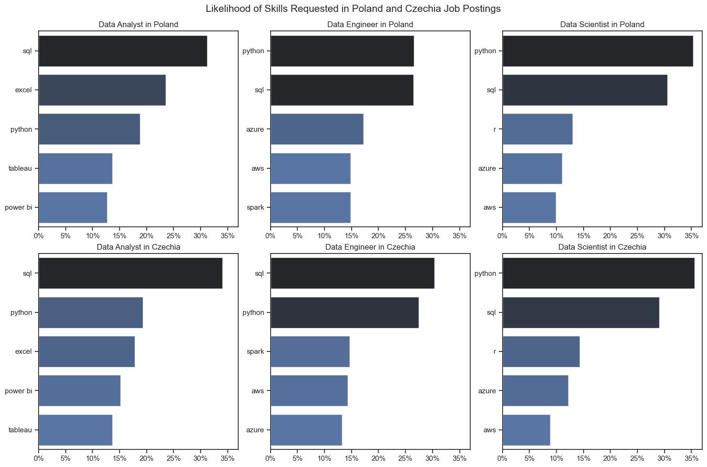
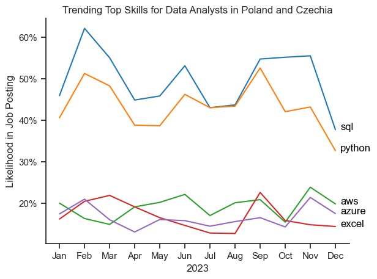
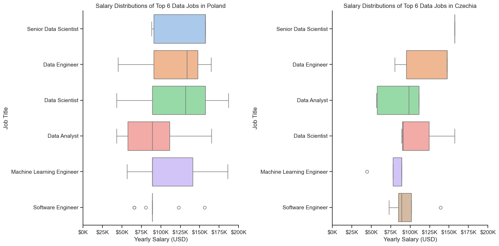
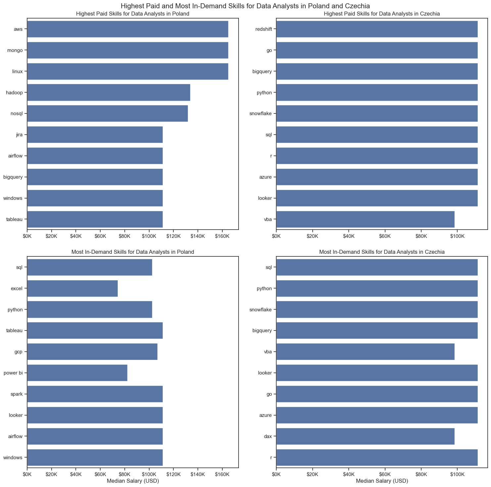
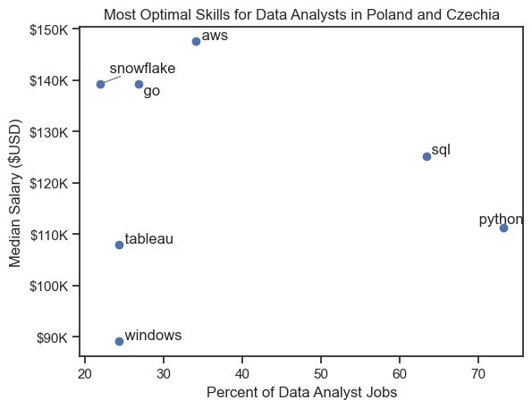
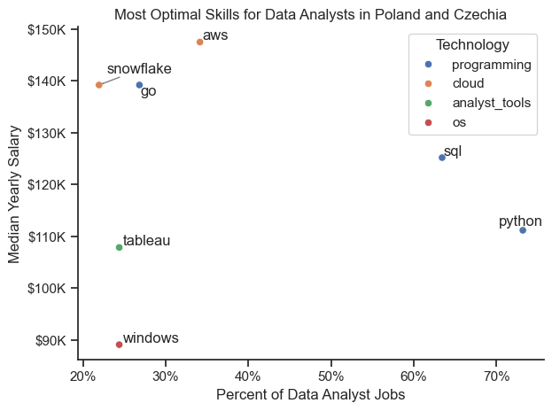

# Overview

Welcome to my analysis of the data job market. This project stems from a need to better understand and navigate the job market.

Utilizing several Python scripts, I address essential questions about the most in-demand skills, salary trends, and the correlation between demand and salary in data analytics.

data source: Luke Barousse (github.com/lukebarousse)

# The Questions
In my project I want to answer following questions: 

1. What are the skills most in demand for the top 3 most popular data roles?
2. How are in-demand skills trending for Data Analysts?
3. How well do jobs and skills pay for Data Analysts?
4. What are the optimal skills for data analysts to learn? (High Demand AND High Paying) 

# Tools I Used
For my detailed examination of the data analyst job market, I utilized several essential tools:
- **Python:** The core of my analysis, enabling data examination and the extraction of insights. The following Python libraries were used:
    
    - **Pandas Library:** data analysis.
    - **Matplotlib Library**: data visualization.
    - **Seaborn Library:** more complex visuals.
- **Jupyter Notebooks:** used to run my Python scripts.
- **Git & GitHub:** version control and sharing.

# Data Preparation and Cleanup
This section outlines the steps taken to prepare the data for analysis, ensuring accuracy and usability.

## Import & Clean Up Data
I start by importing necessary libraries and loading the dataset, followed by initial data cleaning tasks to ensure data quality.

I begin by importing the necessary libraries and loading the dataset. To ensure data quality I perform initial data cleaning.
```python
# Importing libraries
import numpy as np
import ast
import pandas as pd
from datasets import load_dataset
import matplotlib.pyplot as plt
import seaborn as sns

# Loading Data
dataset = load_dataset('lukebarousse/data_jobs')
df = dataset['train'].to_pandas()

# Data Cleanup
df['job_posted_date'] = pd.to_datetime(df['job_posted_date'])
df['job_skills'] = df['job_skills'].apply(lambda x: ast.literal_eval(x) if pd.notna(x) else x)
```

## Filter Jobs
I focused on analyzing the job markets in Poland and Czechia. I applied the appropriate filters to the dataset for relevant job roles (job_title_short) and countries (job_country)

```python
df_DA_CZPL=df[(df['job_country']=='Poland')&(df['job_title_short']=='Data Analyst')|(df['job_country']=='Czechia')&(df['job_title_short']=='Data Analyst')]

```
In some cases, I filtered separately for the Polish and Czech markets:
```python
df_PL = df[df['job_country'] == 'Poland']
df_CZ = df[df['job_country'] == 'Czechia']
```

# The Analysis
Following Jupyter notebook aimed at investigating specific aspects of the data job market, answering some of the following questions:

## 1. What are the most demanded skills for the top 3 most popular data roles?

I identified the top 3 job positions in Poland and Czechia and determined the top 5 skills required for each. The following query highlights the skills to focus on based on the specific role you are targeting.

Check Jupyter notebook for details, Chapter: 2. SKILL DEMAND 

### Visualize Data
```python
fig, ax = plt.subplots(len(job_titles), 1)


for i, job_title in enumerate(job_titles):
    df_plot = df_skills_perc[df_skills_perc['job_title_short'] == job_title].head(5)[::-1]
    sns.barplot(data=df_plot, x='skill_percent', y='job_skills', ax=ax[i], hue='skill_count', palette='dark:b_r')

plt.show()
```

Assuming job_titles and countries are predefined lists and setting theme for seaborn:

```python
job_titles = ['Data Analyst', 'Data Engineer', 'Data Scientist']
countries = ['Poland', 'Czechia']

sns.set_theme(style='ticks')
```
I create the subplots, 2 rows (one for each country) and 3 columns (one for each job title) and convert values to percentage:
```python
fig, ax = plt.subplots(len(countries), len(job_titles), 

for country_idx, country in enumerate(countries):
    for job_idx, job_title in enumerate(job_titles):
        df_plot = df_skills_count[(df_skills_count['job_title_short'] == job_title) & 
                                  (df_skills_count['job_country'] == country)].head(5)[::-1]
        total = df_plot['skill_count'].sum()
        df_plot['skill_count'] = df_plot['skill_count'] / total * 100 
        
        sns.barplot(data=df_plot, x='skill_count', y='job_skills', ax=ax[country_idx, job_idx], hue='skill_count', palette='dark:b_r')Percentage scale
    
        ax[country_idx, job_idx].xaxis.set_major_formatter(PercentFormatter(decimals=0))

plt.show()

```

### Results


*Bar graph visualizing the salary for the top 3 data roles accordingly in Poland and Czechia, and their top 5 skills associated with each.*


### Insights:
- SQL is among the top 2 most demanded skills for each of the filtered positions in both Poland and Czechia.
- The Czech job market for filtered positions requires more advanced skills like SQL and Python. While these skills are also sought after in Poland, Excel is the second most in-demand skill for Data Analyst roles there.
- In both Poland and Czechia, Data Analyst positions also favor proficiency in visualization tools like Power BI and Tableau. Data Scientist and Data Engineer roles, however, prioritize programming skills such as R and cloud technologies like AWS.


## 2. How are in-demand skills trending for Data Analysts?
To identify skill trends for Data Analysts in 2023, I filtered the data analyst positions and grouped the skills by the month of the job postings. This allowed me to determine the top 5 skills for data analysts each month, highlighting their popularity throughout 2023.

Check Jupyter notebook for details, Chapter: 3. SKILLS TREND

### Visualize Data

I count skills per month for Data Analysts job openings and explode job_skills column to find in-demand skills:
```python
df_DA_PLCZ['job_posted_month_no'] = df_DA_PLCZ['job_posted_date'].dt.month

df_DA_PLCZ_explode = df_DA_PLCZ.explode('job_skills')
```

After creating a pivot plot, grouping and sorting by count of the skills per month, I created visualization. Also, I change month number to month name.  

```python
from matplotlib.ticker import PercentFormatter

df_plot = df_DA_CZPL_percent.iloc[:, :5]
sns.lineplot(data=df_plot, dashes=False, legend='full', palette='tab10')

plt.gca().yaxis.set_major_formatter(PercentFormatter(decimals=0))

plt.show()
```

### Results


*Bar graph visualizing the trending top skills for data analysts in Poland and Czechia in 2023.*

### Insights:
- SQL and Python continue to be the most consistently in-demand skills throughout the year. Other leading skills, such as AWS, Azure, and Excel, are in demand about half as much. 
- The demand for skills like SQL and Python is highest at the beginning of the year, with another peak in autumn.
- Cloud technologies such as AWS and Azure, along with Excel, maintain a stable demand throughout the year, fluctuating around 20%.

## 3. How well do jobs and skills pay for Data Analysts?
To determine the highest-paying roles and skills, I focused exclusively on jobs in Poland and Czechia, and examined their median salaries. Initially, I analyzed the salary distributions of common data positions, such as Data Scientist, Data Engineer, and Data Analyst, to understand which roles offer the highest pay.

Check Jupyter notebook for details, Chapter: 4. SALARY ANALYSIS

#### Visualize Data 
Firstly, I filtered data for Poland and Czechia and drop values without salary. I created the list of main job_titles for each country and plot them using box plot. 
```python
sns.boxplot(data=df__top6, x='salary_year_avg', y='job_title_short', order=job_order)

ticks_x = plt.FuncFormatter(lambda y, pos: f'${int(y/1000)}K')
plt.gca().xaxis.set_major_formatter(ticks_x)
plt.show()
```

```python
fig, axes = plt.subplots(1, 2, figsize=(14, 7))

sns.set_theme(style='ticks')
sns.boxplot(ax=axes[0], data=df_PL_top6, x='salary_year_avg', y='job_title_short', order=top6_jobs_PL, palette='pastel')
sns.despine(ax=axes[0])
ticks_x = plt.FuncFormatter(lambda y, pos: f'${int(y/1000)}K')
axes[0].xaxis.set_major_formatter(ticks_x)

sns.boxplot(ax=axes[1], data=df_CZ_top6, x='salary_year_avg', y='job_title_short', order=top6_jobs_CZ, palette='pastel')
sns.despine(ax=axes[1])
axes[1].xaxis.set_major_formatter(ticks_x)

plt.tight_layout()

plt.show()
```

#### Results



*Box plot visualizing the salary distributions for the top 6 data job titles.*

#### Insights

- The boxplot charts provide a comparative analysis of salary distributions for various data-related job titles in Poland and Czechia. In both Poland and Czechia, Senior Data Scientist roles command the highest salaries, highlighting the premium placed on advanced analytical skills and significant experience.
- For Poland, Senior Data Scientist roles show substantial variability in salary distribution. This suggests a wide range of compensation based on experience and skills within the role. In Czechia, while still high, the variability is somewhat less pronounced, indicating more consistency in salary offers for this position. It could also suggest less job postings in Czechia for Senior Data Scientist.
- Data Engineer roles are among the top-paying jobs in both countries, reflecting the high demand for professionals who can build and maintain data infrastructure. The median salary for Data Engineers in Poland is higher than that for Data Scientists, indicating that these roles are particularly valued.
- In Poland, Data Scientists have higher median salaries than Data Analysts, aligning with the additional expertise required for these roles. In Czechia, Data Analysts have a relatively high median salary, close to that of Data Scientists.
- Some medians aligns with left of right side of the box which suggest the amount of job postings is small for the following role. 

### Highest Paid & Most Demanded Skills for Data Analysts
Then, I concentrated my analysis specifically on data analyst positions. I examined both the top-paying skills and the most sought-after skills. I illustrated these findings using bar charts.

Check Jupyter notebook for details, Chapter: 4. SALARY ANALYSIS

#### Visualize Data
Firstly, I investigate the median salary and skill set for Data Analysts to determine the highest paid and most demanded skills. Next, I create horizontal bar charts for each country to:

1. Display the highest paid skills.
2. Show the most in-demand skills.

```python
fig, ax = plt.subplots(2, 2, figsize=(15, 15))

for country_idx, country in enumerate(countries):
    # Top 10 Highest Paid Skills for Data Analysts
    df_plot_top_pay = df_DA_top_pay[df_DA_top_pay['job_country'] == country]
    sns.barplot(data=df_plot_top_pay, x='median', y='job_skills', hue='job_country', ax=ax[0, country_idx], palette='dark:b_r')

    # Top 10 Most In-Demand Skills for Data Analysts
    df_plot_skills = df_DA_skills[df_DA_skills['job_country'] == country]
    sns.barplot(data=df_plot_skills, x='median', y='job_skills', hue='job_country', ax=ax[1, country_idx], palette='dark:b_r')
   

plt.show()
```

#### Results



*Two separate bar graphs visualizing the highest paid skills and most in-demand skills for data analysts in Poland and Czechia*

#### Insights:
- One of the highest-paying skills in both countries is BigQuery, with job offers exceeding $100K.
- SQL is the most in-demand skill in both countries and is among the highest-paid skills in Czechia.
- Data analysts seeking to maximize their career potential should focus on acquiring a diverse skill set that encompasses both lucrative specialized skills and broadly demanded foundational skills.

## 4. What are the most optimal skills to learn for Data Analysts?
To determine the most valuable skills (highest paid and in-demand), I calculated the percentage of demand and the median salary for each skill. This approach helps easily identify the skills that are both highly paid and in high demand.

Check Jupyter notebook for details, Chapter: 5. OPTIMAL SKILLS.
#### Visualize Data
I cleaned the data by removing NaN values from the 'salary_year_avg' column. Next, I used the explode method on the 'job_skills' column and calculated the median salary and count for each skill, as well as the percentage of job postings listing those skills. I filtered out any skills without associated job postings. Finally, I created a scatter plot to visualize the relationship between the percentage of Data Analyst jobs requiring specific skills and the median salary for those skills.

```python
from adjustText import adjust_text

plt.scatter(df_DA_skills_high_demand['skill_percent'], df_DA_skills_high_demand['median_salary'])

plt.show()
```

#### Results


*A scatter plot visualizing the most optimal skills (high paying & high demand) for data analysts in the US.*

#### Insights:
- The scatter plot shows the relationship between the percentage of Data Analyst jobs requiring specific skills and the median salary for those skills in Poland and Czechia.

- The skill AWS stands out with the highest median salary of nearly $150K, despite being moderately common in job postings. This indicates a high value placed on cloud computing skills within the data analyst profession.

- More commonly required skills like Python and SQL have a large presence in job listings. 

- Specialized skills such as Snowflake and Go also command high salaries but are less common in job listings, highlighting their niche value.

### Visualizing Different Techonologies
I visualize different techonogies on the graph.

#### Visualize Data
```python
from matplotlib.ticker import PercentFormatter

scatter = sns.scatterplot(
    data=df_DA_skills_tech_high_demand,
    x='skill_percent',
    y='median_salary',
    hue='technology',  
    palette='bright', 
    legend='full' 
)
plt.show()
```

#### Results


*A scatter plot visualizing the most optimal skills (high paying & high demand) for data analysts in the US with color labels for technology.*

#### Insights:

- The scatter plot indicates that most programming skills (blue dots) are among the most in-demand.

- Cloud solutions (orange dots), such as AWS and Snowflake, are linked to some of the highest salaries for data analyst tools.

Analyst tools (green dots) like Tableau are not as widely demanded as programming skills, although they still command some of the top salaries in job postings.

# What I Learned

Throughout this project, I gained a deeper understanding of the data analyst job market and improved my technical skills in Python, particularly in data manipulation and visualization.

Leveraging libraries such as Pandas for data manipulation, Seaborn and Matplotlib for data visualization, and other libraries enabled me to efficiently perform complex data analysis tasks. I learned that thorough data cleaning and preparation are essential before conducting any analysis, ensuring the accuracy of the insights derived from the data. The project highlighted the significance of aligning one's skills with market demand. Understanding the relationship between skill demand, salary, and job availability facilitates more strategic career planning in the tech industry.

# Insights

There is a clear link between the demand for specific skills and the salaries associated with them. Advanced and specialized skills like Python and SQL  often result in higher pay.
The demand for skills is subject to change, reflecting the dynamic nature of the data job market. Staying updated with these trends is crucial for career advancement in data analytics.
Identifying which skills are both highly demanded and well-compensated can help data analysts prioritize their learning to maximize economic benefits.

# Challenges I Faced

Addressing missing or inconsistent data entries demands meticulous attention and comprehensive data-cleaning methods to maintain the analysis's accuracy.

Creating effective visualizations of intricate datasets was difficult but essential for presenting insights in a clear and engaging manner.

Striking a balance between deeply exploring each analysis and keeping a wide perspective on the data landscape was necessary to provide thorough coverage without becoming bogged down in specifics.


# Conclusion
This deep dive into the data analyst job market has been highly enlightening, shedding light on the vital skills and trends that define this dynamic field. The insights gained have deepened my understanding and offer practical advice for those aiming to progress in data analytics. As the market evolves, continuous analysis will be crucial to remain competitive in data analytics.


